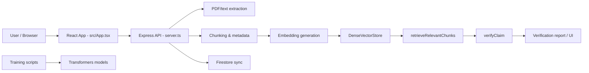
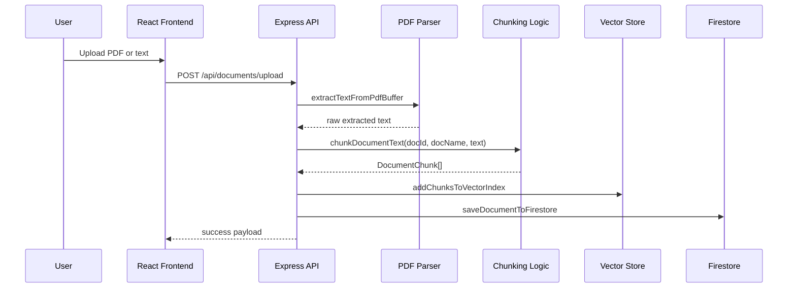
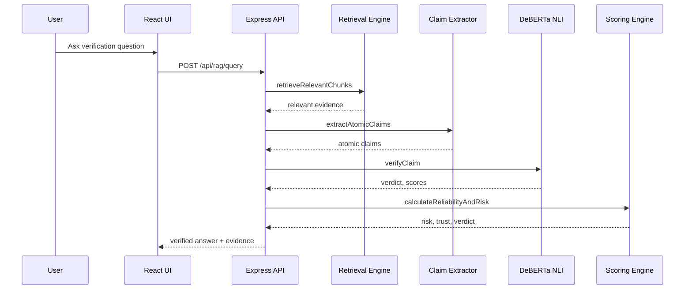
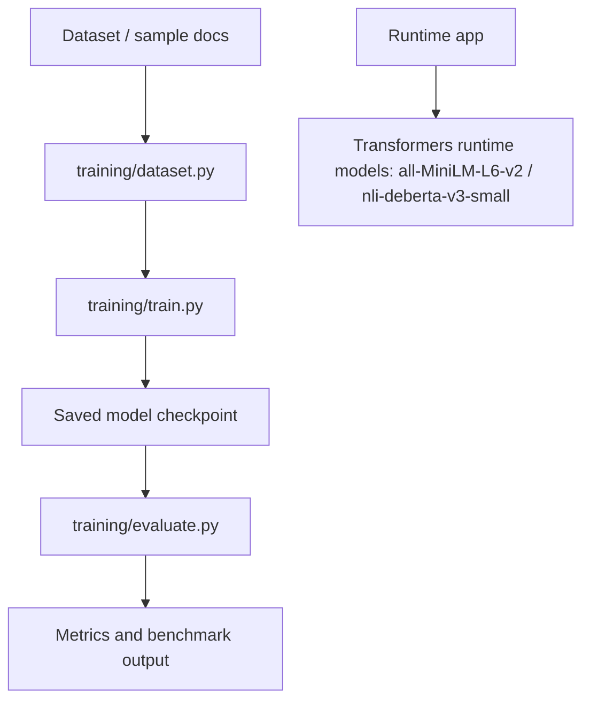

# Architecture

## System architecture

## Document ingestion

## Claim verification

## Model/training workflow

## Boundaries

- Frontend is React/Vite; it is not the authoritative data store.
- Express API is the authority for upload and query orchestration.
- Firestore is persistence, but vector indexing is local in-memory plus JSON file persistence.
- Training scripts are separate from the runtime inference pipeline and should not be confused with deployed model status.

## Dependencies

- React 19, Vite 6, Express 4, Firebase 12, pdf-parse 2, @xenova/transformers 2.17.
- Runtime models are downloaded on demand by the transformers package.
